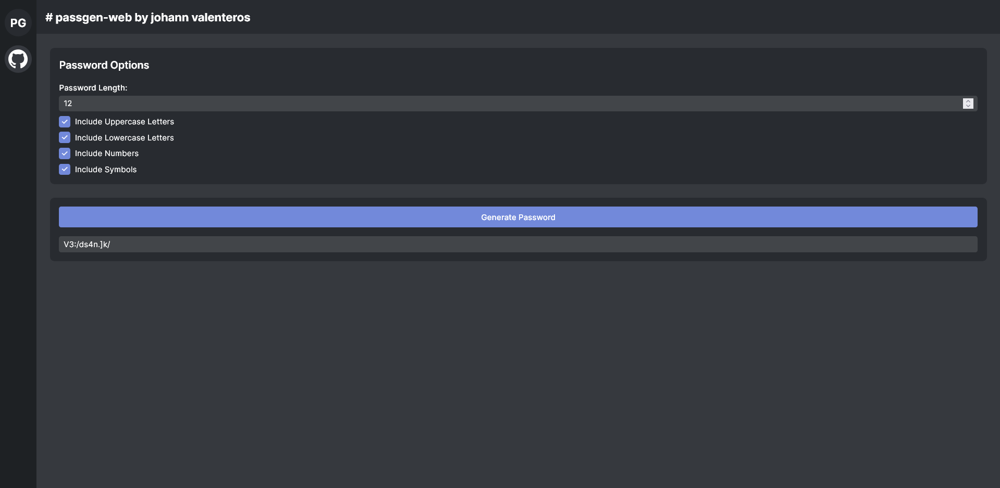
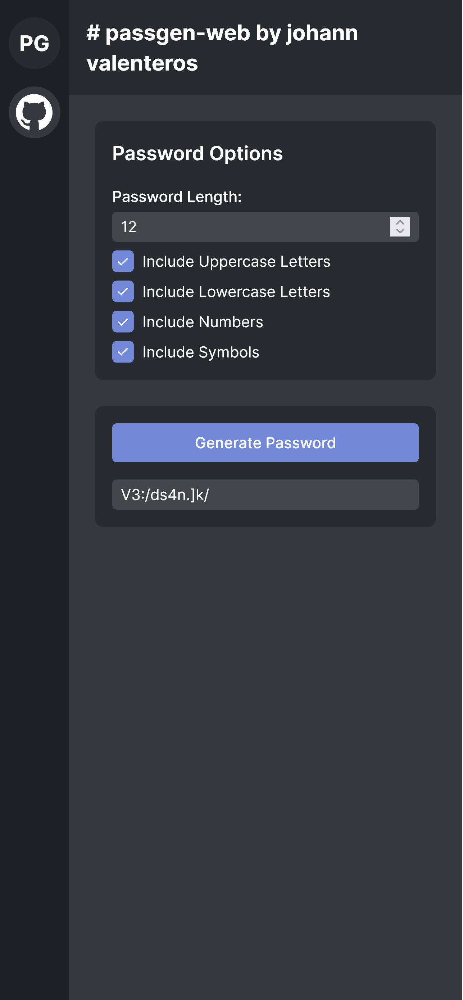

# passgen-web by jvalenteros

A sleek, Discord-inspired styled password generator web application built with HTML, Tailwind CSS, and JavaScript.

## Features

- Generate secure passwords with customizable options
- Responsive design
## Screenshots

### Main Interface


### Mobile View


## Installation

1. Clone the repository:
   ```
   git clone https://github.com/yourusername/discord-style-password-generator.git
   ```
2. Navigate to the project directory:
   ```
   cd discord-style-password-generator
   ```
3. Open `index.html` in your web browser.

## Usage

1. Set your desired password length (8-32 characters).
2. Select the character types you want to include:
   - Uppercase letters
   - Lowercase letters
   - Numbers
   - Symbols
3. Click "Generate Password".
4. Copy the generated password from the input field.

## Customization

You can easily customize the color scheme by modifying the Tailwind config in the HTML file:

```javascript
tailwind.config = {
    theme: {
        extend: {
            colors: {
                discord: {
                    blurple: '#7289da',
                    dark1: '#424549',
                    dark2: '#36393e',
                    dark3: '#282b30',
                    dark4: '#1e2124',
                },
            },
            // ...
        },
    },
}
```

## Contributing

Contributing is always encouraged, please feel free to submit a pull request.

## License

This project is open source and available under the [MIT License](LICENSE).

## Credits

- Built with [Tailwind CSS](https://tailwindcss.com/)
- GitHub logo provided by [GitHub](https://github.com/logos)
- UI Design inspired by Discord